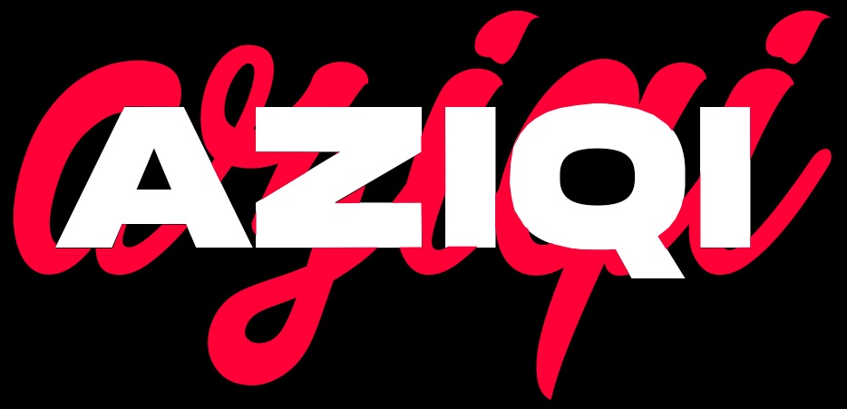

  

<h1 align="center">🎬 AZ-MPV</h1>

  <b>Next-Generation MPV Video Player (Fork of MPV PLAYKIT) featuring AI Upscaling, Custom Shaders, Modern UOSC UI, and Dedicated Subtitle Engine.</b>

  <a href="README.id.md"><b>🇮🇩 Bahasa Indonesia</b></a> | <b>🇬🇧 English</b>

  

  
  
  
  
  

---

## 📌 Quick Navigation

- [🌟 About AZ-MPV](#-about-az-mpv)
- [⚡ Stock MPV vs AZ-MPV Comparison](#-stock-mpv-vs-az-mpv)
- [🚀 Key Features](#-key-features)
- [⌨️ Keyboard Shortcuts](#️-keyboard-shortcuts)
- [📥 Installation & Usage](#-installation--usage)
- [📄 License & Credits](#-license--credits)

---

## 🌟 About AZ-MPV

**AZ-MPV** is a high-performance desktop media player developed as a **fork and enhanced continuation of [MPV PLAYKIT](https://github.com/hooke007/mpv_PlayKit)** by *hooke007*. 

> 🌐 **Full English Translation:** The original *mpv_PlayKit* project originated in Chinese. In **AZ-MPV**, all interface menus, configuration files (`mpv.conf`, `input_uosc.conf`), Lua/JS scripts, and OSD messages have been **fully translated into English** (with added support for Indonesian subtitle auto-translation).

Combining **AI Motion Interpolation (RIFE)**, **AI Super Resolution (ESRGAN/ARTCNN)**, **Custom Shaders (Anime4K/KrigBilateral)**, and a **Modern UOSC UI**, AZ-MPV delivers a cinema-grade viewing experience out of the box with zero setup hassle.

---

## ⚡ Stock MPV vs AZ-MPV

| Feature | Stock MPV | 🎬 **AZ-MPV** |
| :--- | :---: | :---: |
| **User Interface (UI)** | Minimal / Command Line | **Modern UOSC UI with Glassmorphism & Control Bar** |
| **Subtitle Engine** | Basic System Fonts | **Bundled Portable Ubuntu Fonts + Interactive Subtitle Settings Menu** |
| **Aspect Ratio Control** | Manual Configuration | **1-Click VLC-Style Aspect Ratio Switcher (16:9, 21:9, 4:3)** |
| **AI Motion Interpolation** | ❌ None | **✅ 60FPS+ RIFE AI Frame Smoothing (NVIDIA TensorRT)** |
| **AI Super Resolution** | ❌ None | **✅ ESRGAN, ARTCNN, & ACNET Machine Learning Models** |
| **GPU Shader Suite** | ❌ Manual Setup | **✅ Anime4K, KrigBilateral, & SSimSuperRes Pre-Configured** |
| **Audio Processing** | Raw Output | **LUFS -16 Loudness Normalization + Vocal Clarity EQ** |
| **Interface Language** | Standard | **Full English Translated (100% Chinese-Free)** |
| **Installation** | Setup Required | **100% Portable (Extract & Run)** |

---

## 🚀 Key Features

### 🇬🇧 1. Full English Translation & Localization
- **100% Chinese-Free Interface:** All UOSC menus, OSD messages, config comments, and script popups translated into clean English.
- **Auto Translation & Dual Subtitles:** Built-in subtitle translation (`Alt+T`) and dual subtitle rendering (`Alt+J`).

### 🎨 2. Subtitle Engine & Custom UOSC Menu
- **Ubuntu Font Family (Portable):** Clean, modern **Ubuntu** typography bundled portably inside `portable_config/fonts/`.
- **⚙️ Interactive Subtitle Settings Menu:** Real-time controls directly inside UOSC:
  - 📐 **Font Size** (`−` / `+` by 2 pt)
  - 🔤 **Bold Text** (Toggle On / Off)
  - 🖤 **Background Opacity** (`−` / `+` by 10%)
  - 📍 **Vertical Position / Margin Y** (`−` / `+` by 5 px)
  - ⏱️ **Subtitle Delay** (`−` / `+` by 0.1s)
  - 📏 **Subtitle Scale** (`−` / `+` by 0.1x)
  - 🔄 **Reset to Default Settings**
- **Dynamic ASS Override:** ASS subtitles (`.ass`) retain original author styles by default (`sub-ass-override=no`), but dynamically enable forced override whenever manually adjusted via UOSC.

### 🤖 3. AI Video Processing & Upscaling (VapourSynth)
- **AI Motion Smoothing (RIFE):** Real-time 60FPS+ frame interpolation powered by NVIDIA TensorRT.
- **AI Super Resolution:** Enhance low-resolution videos with **ESRGAN**, **ARTCNN**, and **ACNET** machine learning models.
- **🧼 AI Denoise & Deband:** Advanced BM3D & CCD filters via VapourSynth.

### 🖌️ 4. Shaders Manager & Auto Profiles
- **GPU Shader Pipeline:** Pre-configured with `KrigBilateral.glsl` (Chroma Upscaling), `SSimSuperRes`, and full `Anime4K` suite.
- **Smart Profiles:**
  - 🌈 **HDR & Dolby Vision:** Auto BT.2020 PQ/HLG color mapping.
  - 🎨 **SDR-to-HDR:** Interactive Fake HDR shader (`FX_FAKE_HDR_v2.glsl`).
  - 📺 **Anime Mode:** Dedicated debanding & anime color tuning.
  - 🔋 **Battery Saver:** Auto energy saving when unplugged.

### 🎛️ 5. Modern UOSC UI & Player Controls
- **VLC-Style Aspect Ratio Switcher:** Quick aspect ratio toggle (`16:9`, `21:9` Cinema, `4:3`, `Standard`) with precise letterboxing.
- **Timeline Thumbnails:** Hover preview thumbnails on seek bar (`thumbfast`).
- **Real-Time FPS Overlay:** Live performance & frame rate indicators.

### 🔊 6. Audio Pipeline & Vocal EQ
- **Loudness Normalization:** LUFS -16 audio leveling to balance soft whispers and loud action scenes.
- **Vocal Equalizer:** Dialogue frequency optimization (300Hz cut, 1.5kHz vocal boost, 3.5kHz clarity boost) ideal for IEMs & speakers.

---

## ⌨️ Keyboard Shortcuts

| Key | Action |
|---|---|
| **Right Click** | Open Main AZ-MPV Menu (UOSC) |
| **Left Click (Drag)** | Move video window position |
| **Mouse Scroll** | Adjust volume / Seek video |
| **F2 / F3** | Toggle AI Upscaling & Frame Interpolation (RIFE) |
| **Ctrl + \`** | Clear all active shaders |
| **Alt + T** | Cycle Subtitle Auto-Translation (Off → EN → ID) |
| **Alt + J** | Toggle Secondary Subtitle (Dual Subtitles) |
| **Ctrl + S / Ctrl + Shift + S** | Take Screenshot (Scaled / Full Window) |
| **1 / 2** | Adjust video contrast |

---

## 📥 Installation & Usage

1. Click here to [**Download AZ-MPV Portable Package (Google Drive)**](https://drive.google.com/file/d/1QyLVprMEWmaKsBpAuWCUBReWt5Fs2Oic/view?usp=sharing).
2. Extract the downloaded `.zip` package to any folder (e.g., `C:\AZ-MPV` or `D:\AZ-MPV`).
3. Run **`mpv.exe`** or **`MPV.bat`** to start watching!

---

## ⭐ Support & Feedback

If you find **AZ-MPV** useful, please consider giving this repository a **🌟 Star** on GitHub!

---

## 📄 License & Credits

- **Developer:** [Aziqi](https://github.com/aziqi)
- **Base Project:** [MPV PLAYKIT by hooke007](https://github.com/hooke007/mpv_PlayKit) (Originally in Chinese, fully translated & enhanced)
- **Core Engine:** [MPV Player](https://mpv.io)
- **UI Engine:** [UOSC](https://github.com/tomaskovacik/uosc)
